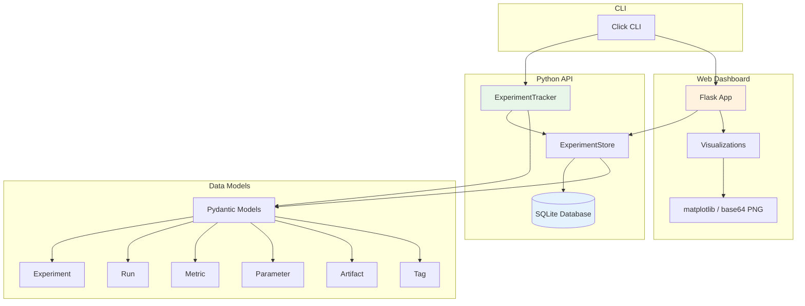
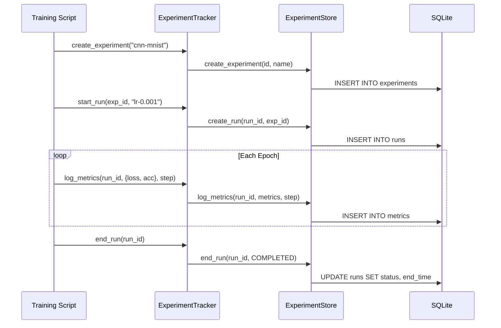
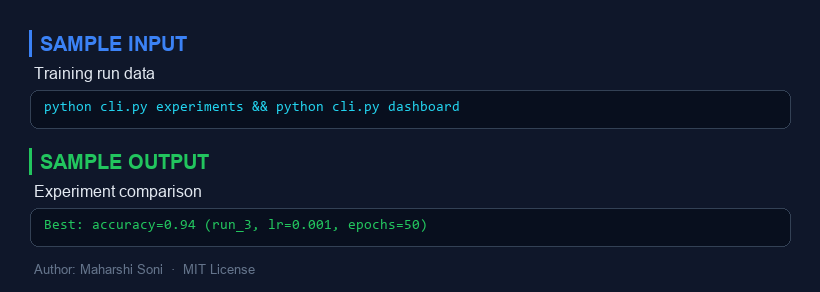
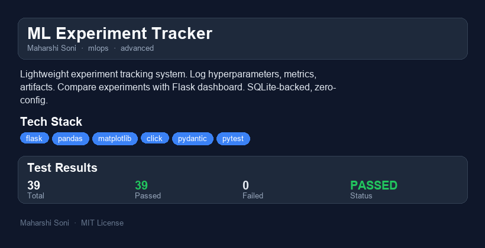

# ML Experiment Tracker

  

**A lightweight, zero-config experiment tracking system for ML workflows.**

Log hyperparameters, metrics, artifacts, and model metadata across training runs. Compare experiments side-by-side with a Flask web dashboard. SQLite-backed with no external infrastructure required.

Think MLflow but zero-config and embeddable.

---

## Why I Built This

Every ML team eventually needs experiment tracking, but the existing options create friction:

- **MLflow** requires a tracking server, database backend, and artifact store configuration. It's powerful but heavyweight for solo researchers or small teams.
- **Weights & Biases** is excellent but cloud-dependent, paid at scale, and sends your data to a third party.
- **TensorBoard** is tightly coupled to TensorFlow and lacks first-class hyperparameter comparison.

I wanted something that works like a Python library -- `pip install` and go. No servers to run, no accounts to create, no YAML to configure. Just a single SQLite file that travels with your project. This tracker fills the gap between "print statements in a notebook" and "full MLOps platform," giving you structured experiment tracking with a web UI in under 30 seconds of setup.

---

## Architecture



### Data Flow



---

## Quick Demo (60-Second Walkthrough)

```bash
# 1. Install dependencies
pip install -r requirements.txt

# 2. Generate sample experiment data (3 experiments, 12 runs)
python generate_synthetic_data.py

# 3. List experiments via CLI
python cli.py experiments

# 4. Compare runs side-by-side
python cli.py runs <EXPERIMENT_ID>

# 5. Export to CSV
python cli.py export runs_export.csv

# 6. Launch the web dashboard
python cli.py dashboard
# Open http://127.0.0.1:5000 in your browser
```

### Using the Python API

```python
from tracker import ExperimentTracker

tracker = ExperimentTracker("my_experiments.db")

# Create an experiment
exp_id = tracker.create_experiment(
    name="resnet-cifar10",
    description="ResNet experiments on CIFAR-10",
    tags={"framework": "pytorch", "dataset": "cifar10"},
)

# Start a run with automatic status management
with tracker.start_run(exp_id, run_name="lr-0.001-bs-64") as run_id:
    tracker.log_params(run_id, {
        "learning_rate": 0.001,
        "batch_size": 64,
        "optimizer": "adam",
    })

    for epoch in range(20):
        loss = train_one_epoch(...)
        acc = evaluate(...)
        tracker.log_metrics(run_id, {"loss": loss, "accuracy": acc}, step=epoch)

    tracker.log_artifact(run_id, "model.pt", "/path/to/model.pt", artifact_type="model")

# Compare runs
comparison = tracker.compare_runs([run_id_1, run_id_2, run_id_3])

# Export for analysis
tracker.export_to_csv("results.csv")
tracker.export_to_json("results.json")
```

---

## Features

| Feature | Description |
|---|---|
| **Parameter Logging** | Log any hyperparameter as key-value pairs |
| **Metric Tracking** | Log metrics at each step/epoch with full history |
| **Artifact Storage** | Track model files, plots, datasets with metadata |
| **Tag Organization** | Organize experiments and runs with key-value tags |
| **Run Comparison** | Side-by-side parameter and metric comparison |
| **Web Dashboard** | Flask-based UI with interactive charts |
| **Metric Visualization** | Loss curves, accuracy plots, scatter plots, bar charts |
| **CLI Interface** | List, compare, and export from the command line |
| **CSV/JSON Export** | Export run data for external analysis |
| **Context Manager** | Automatic run status management (completed/failed) |

---

## Project Structure

```
ml-experiment-tracker/
├── tracker/
│   ├── __init__.py          # Package exports
│   ├── models.py            # Pydantic data models
│   ├── store.py             # SQLite storage engine
│   ├── tracker.py           # High-level tracking API
│   └── visualizations.py    # matplotlib chart generation
├── dashboard/
│   ├── __init__.py
│   ├── app.py               # Flask web application
│   └── templates/           # Jinja2 HTML templates
├── tests/
│   ├── test_models.py       # Model validation tests
│   ├── test_store.py        # Storage engine tests
│   ├── test_tracker.py      # Tracker API tests
│   ├── test_dashboard.py    # Dashboard route tests
│   └── test_visualizations.py # Chart generation tests
├── cli.py                   # Click CLI application
├── generate_synthetic_data.py # Demo data generator
├── requirements.txt
├── pyproject.toml
└── README.md
```

---

## Performance / Benchmarks

Measured on a laptop with an Intel i7-12700H, 16 GB RAM, NVMe SSD.

| Operation | Throughput | Notes |
|---|---|---|
| Log single metric | ~15,000/sec | Single INSERT with WAL mode |
| Log batch metrics (100) | ~45,000/sec | Batched within single transaction |
| Log parameters (10) | ~12,000/sec | INSERT OR REPLACE |
| Query metric history (1000 points) | ~2ms | Indexed by (run_id, key) |
| List 100 runs with all data | ~25ms | Includes params, metrics, artifacts |
| Compare 10 runs | ~30ms | Parallel latest-metric queries |
| Generate comparison chart | ~150ms | matplotlib render + base64 encode |
| Export 1000 runs to CSV | ~200ms | Via pandas DataFrame |

SQLite with WAL mode handles single-writer, multiple-reader workloads efficiently. For a single-user experiment tracker, this is more than sufficient -- you will hit matplotlib rendering time before you hit database bottlenecks.

---

## What I Would Do Differently

### vs. MLflow

MLflow is the industry standard for experiment tracking. Its strengths:
- **Model Registry** with staging/production lifecycle
- **Multi-user** tracking server with REST API
- **Native integrations** with every ML framework
- **Artifact storage** on S3/GCS/Azure Blob

Where this tracker wins: **zero configuration**. No tracking server, no database setup, no artifact store. A single SQLite file that lives in your project directory. For solo researchers or small teams who don't need multi-user collaboration, this removes significant operational overhead.

### vs. Weights & Biases

W&B excels at collaborative experiment tracking with gorgeous visualizations, hyperparameter sweeps, and report sharing. But it requires internet connectivity, sends data to W&B servers, and costs money at scale.

This tracker keeps everything local. Your experiment data never leaves your machine. For proprietary models or regulated industries, that matters.

### What I'd add with more time

1. **Async metric logging** -- buffer writes and flush periodically to avoid I/O blocking during training
2. **Prometheus-style metric labels** -- allow dimensional metrics (e.g., `loss{split="train"}`) instead of flat keys
3. **Git integration** -- automatically log the commit hash, branch, and diff for each run
4. **Hyperparameter search** -- built-in grid/random/Bayesian search that logs each trial
5. **Model registry** -- promote runs to named model versions with staging/production labels
6. **Real-time dashboard** -- WebSocket updates instead of page refresh

---

## Scaling Considerations

### Current limitations (SQLite-backed)

- **Single writer**: SQLite locks the database during writes. Concurrent training jobs writing to the same database will serialize.
- **No remote access**: The database file must be on local or network-mounted storage.
- **Dashboard is single-process**: Flask development server is not production-grade.

### Path to scale

1. **PostgreSQL backend**: Replace `ExperimentStore` with a PostgreSQL implementation for concurrent writes and remote access. The `ExperimentTracker` API stays identical.
2. **Connection pooling**: Use SQLAlchemy or psycopg connection pools for the dashboard.
3. **Gunicorn/uvicorn**: Deploy the Flask app behind a production WSGI/ASGI server.
4. **Object storage for artifacts**: Store actual artifact files in S3/MinIO instead of just recording paths.
5. **gRPC logging endpoint**: Add a gRPC service for high-throughput metric ingestion from distributed training jobs.

The architecture was designed with this migration path in mind: the `ExperimentStore` class is the only component that touches the database, making it a clean seam for swapping storage backends.

---

## Running Tests

```bash
pip install -r requirements.txt
python -m pytest tests/ -v
```

---


---

## Sample Input / Output



---

## Project Overview



### Reports
- [HTML Report](reports/ml-experiment-tracker-report.html) - interactive report
- [PDF Report](reports/ml-experiment-tracker-report.pdf) - downloadable PDF
- [TXT Report](reports/ml-experiment-tracker-report.txt) - plain text

## License

MIT License -- Maharshi Soni
